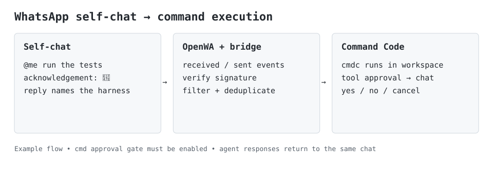
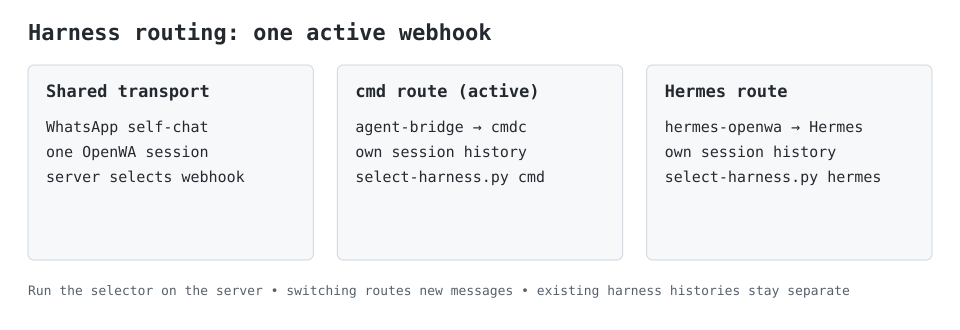
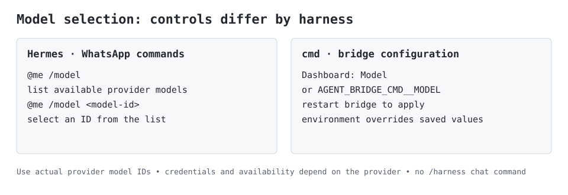
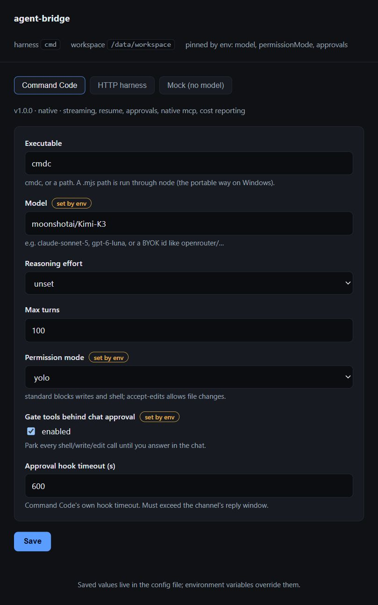

# agent-bridge

WhatsApp now supports direct model/harness commands, named threads and file exchange.
See [chat controls and private context imports](docs/chat-controls.md) for commands,
export import instructions and clarification transport limits.

[](https://github.com/mayurathavale18/agent-bridge/actions/workflows/ci.yml)
[](LICENSE)


One event contract. Many agent harnesses. Many chat channels.

A harness-agnostic bridge for driving coding agents (Command Code, Claude Code, Codex,
or your own adapter) from chat — starting with WhatsApp. The bridge does not
implement an agent loop; it normalizes whatever a harness emits into one event language and
lets channels render it.



*Technical cmd workflow. Accepted prompts receive a 👾 reaction; agent replies name the harness.
Chat approvals require the approval gate to be enabled.*

```
WhatsApp ──► OpenWA ──webhook──►  ┌──────────────────────────────┐        ┌─ cmd
                                  │           BRIDGE             │        ├─ claude
   CLI ─────────────────────────► │  normalize · route · approve │ ─────► ├─ codex
                                  │  queue · session · sandbox    │        ├─ http (any lang)
                                  └──────────────────────────────┘        └─ native plugin
```

The contract lives in [`docs/harness-spec.md`](docs/harness-spec.md).

## Motivation

The agent ecosystem is fragmenting in a way that works against the people using it. I run
Command Code daily, Hermes for WhatsApp, Codex for some things — and each one arrives with its
own transport, its own session model, and its own assumptions about being driven from a
terminal. None of them are reachable from my phone, which is where half my actual thinking
happens.

Writing a WhatsApp integration per agent is a losing game: every integration re-solves the same
problems — webhook verification, duplicate suppression, reply chunking, keeping the agent's own
messages from re-triggering it — and none of it is the interesting part. The interesting part is
the *contract*: if every harness normalizes to one event language, a channel written once works
with every agent, past and future.

The second motivation is safety. A chat message is remote code execution with casual UX: it
arrives while you're away, in a medium designed for quick replies. The approval transport here
exists because I wanted to be asked, in the same chat, before an agent touched something
destructive — and I wanted the failure mode of an unanswered approval to be *silence*, not a
default yes.

The third is ownership. Agents are only as private as the credentials they hold, so this bridge
is built to deploy onto my own cluster, next to my own data, with no relay in the middle.

## Status

The `cmd` adapter, WhatsApp channel, config dashboard, queue, session routing and chat approval
transport are implemented. The Contabo k3s deployment has been verified with live model replies
and a shell request that paused for approval and respected a denial.

| Piece | State |
| --- | --- |
| Normalized event model (`AgentEvent`) | done |
| `AgentRunner` interface + capabilities | done |
| `harness.json` manifest + validation | done |
| `cmd` adapter (Command Code NDJSON) | done, verified live |
| `claude-code` adapter | done — streaming, resume and chat permissions |
| `codex` adapter | done — streaming and resume; chat ask mode unsupported |
| `http` adapter (generic wire) | done |
| `mock` adapter (deterministic, no cost) | done |
| CLI channel | done |
| OpenWA / WhatsApp channel | done |
| Config dashboard (schema-driven) | done |
| Approval transport over chat | done |
| Per-chat queue (single-flight) | done |
| Session routing (resume across messages) | done — persists across restarts |

## One chat, different harnesses and models



Switching Hermes ↔ Command Code changes the active OpenWA webhook on the server. Only one
receives new messages; each harness retains its own history. Use the [Contabo selector commands](docs/contabo.md) for this deployment.



With Hermes selected, send `@me /model` to see available models, then
`@me /model <model-id>` with an actual provider model ID. Availability and cost depend on your provider.
With Agent Bridge selected, use `@me /harnesses`, `@me /harness <id>`,
`@me /models` and `@me /model <id|default>` directly in the self-chat.
Each harness keeps separate histories. The external Hermes integration still uses the
server-side webhook selector. See [chat controls](docs/chat-controls.md).

## Install

Start with the [minimal setup](docs/quickstart.md): one authenticated CLI and Node.js.
Codex (`--harness codex`) and Claude Code (`--harness claude-code`) support streamed
progress and session resume. Their native permission policies apply; chat approval
round-trips are supported by cmd and Claude Code, while Codex ask mode is unsupported.
See [contributing](CONTRIBUTING.md) for development.

From npm (ships a compiled `dist/`, so any Node ≥ 22.6 works):

```bash
npm install -g @mayurathavale18/agent-bridge
agent-bridge --list
agent-bridge --harness mock "hello from the bridge"
```

The mock emits deterministic events without a model, credentials or WhatsApp account.
For a real run, install and sign in to the selected native CLI first, then run:

```bash
agent-bridge --harness codex --workspace . "Summarize this repository"
# or: agent-bridge --harness claude-code --workspace . "Summarize this repository"
```

**Zero external dependencies means zero runtime npm dependencies in Agent Bridge.**
Node.js is required; real harnesses need their own CLI and authentication, and WhatsApp
needs a separately configured OpenWA service. Development uses TypeScript and Node types.
After configuring the [WhatsApp environment](#drive-it-from-whatsapp),
`agent-bridge-serve` starts the channel server and dashboard.

Or straight from source — no build step, Node ≥ 22.6 strips the types:

```bash
npm install          # only for typecheck; running needs no deps
node src/index.ts --list
```

`cmd` runs in headless mode, which **blocks file writes and shell commands by default**.
Pass `--permission-mode accept-edits` (or `yolo`) only inside a sandboxed workspace.

On Windows the installed CLI is a `.cmd` shim, which cannot be executed without a shell —
and the bridge deliberately never uses a shell, because the prompt is untrusted input. Point
the adapter at the package's JavaScript entry instead:

```bash
node src/index.ts --harness cmd \
  --config binary="$(npm root -g)/command-code/dist/index.mjs" \
  "summarize this repo"
```

The adapter runs any `.js`/`.mjs`/`.cjs` config value through the current Node, so this works
identically on every platform.

## Run it from source

```bash
npm run list         # show harnesses and their capabilities
npm run demo         # run the mock harness (no model, no cost)

# a real harness
node src/index.ts --harness cmd --workspace . --model claude-sonnet-5 "summarize this repo"

# any HTTP harness
node src/index.ts --harness http --url http://localhost:8787 "do the thing"

# load a plugin from a manifest
node src/index.ts --manifest examples/harness.cmd.json "say hi"

npm run typecheck
npm test
```

## Drive it from WhatsApp

Start the channel, then point an OpenWA webhook at it (`message.received` and `message.sent`):

```bash
OPENWA_API_KEY=owa_k1_... \
OPENWA_WEBHOOK_SECRET=... \
AGENT_BRIDGE_HARNESS=cmd \
AGENT_BRIDGE_CMD__MODEL=gpt-6-luna \
npm run serve
```

| Env | Meaning |
| --- | --- |
| `OPENWA_API_KEY` | required — the gateway API key |
| `OPENWA_BASE_URL` | default `http://127.0.0.1:2785` |
| `OPENWA_WEBHOOK_SECRET` | HMAC secret; **unset disables signature verification** (warned at boot) |
| `OPENWA_SESSION_ID` | pin the sending session instead of trusting the payload |
| `AGENT_BRIDGE_HARNESS` | pins the active harness (`cmd` default), overriding the dashboard |
| `AGENT_BRIDGE_WORKSPACE` | working directory for runs (default cwd) |
| `AGENT_BRIDGE_CONFIG_FILE` | JSON file the dashboard writes (active harness + per-harness values) |
| `AGENT_BRIDGE_SESSION_FILE` | JSON file persisting chat → session, so a restart keeps the thread |
| `AGENT_BRIDGE_<ID>__<KEY>` | pins one harness setting, e.g. `AGENT_BRIDGE_CMD__MODEL=gpt-6-luna` |
| `AGENT_BRIDGE_APPROVAL_TIMEOUT_MS` | how long to wait for an approval reply (default `120000`) |
| `WA_PORT` / `WA_HOST` | default `8788` / `127.0.0.1` |
| `DASHBOARD_PORT` / `DASHBOARD_HOST` | default `8789` / `127.0.0.1` |

Then message **yourself** in WhatsApp, tagging your own number (or writing `@me`):

```
@me list the repos in this workspace
```

The bridge replies in the self-chat with a `working...` message that it edits as tools run,
then replaces with the answer.

Four things keep this safe, all enforced in `src/channels/whatsapp/`:

1. **Signature** — every webhook must carry a valid `X-OpenWA-Signature` (HMAC-SHA256 over the raw body).
2. **Idempotency** — OpenWA retries; the `idempotencyKey` is deduped so a retry cannot run twice.
3. **Self-chat only** — sent by you, not a group, with both endpoints matching your configured self identities. Phone JIDs and LIDs can differ; configure both in `OPENWA_SELF_JID`.
4. **Mention-gated + echo guard** — a run needs a real self-mention (or `@me`); replies the bridge posts carry neither, so it can never trigger itself.

### Approvals from the chat

When a harness wants to do something destructive it emits `approval_request`; the run parks
and the chat message becomes:

```
approval needed: Run "git push --force" on main?
reply "yes" to approve, "no" to deny, or "cancel" to stop the run
```

Your reply is matched to the waiting run, delivered through `AgentRunner.respondApproval`, and
the run continues. Three deliberate behaviours, each covered by a test:

- **Ambiguous replies never decide.** Anything unrecognized re-prompts and the run stays parked —
  guessing on an approval is exactly how an unintended command runs.
- **Unanswered approvals deny.** After `AGENT_BRIDGE_APPROVAL_TIMEOUT_MS` the approval resolves to
  deny, so a forgotten prompt can never become a silent yes.
- **`cancel` denies *and* aborts** — the harness receives the deny and its `AbortSignal` fires, so
  a real harness kills the running child process.

**How it works for `cmd`** (`approvals: true`, or the dashboard's *Gate tools behind chat
approval*): Command Code's `PreToolUse` hook is the
gate. The adapter installs one into the workspace's `.commandcode/settings.json` for the run —
merging with whatever is already there and restoring the exact previous bytes afterwards — points
it at a loopback callback server, and each shell/write/edit call arrives in the chat as
`SHELL: rm -rf build` and waits for your answer. The hook **fails closed**: if the bridge is
unreachable it denies rather than allowing.

There are two independent gates, and this is the subtle part: headless mode denies shell/write/edit
outright *regardless of hooks*, so without lifting that, every "approve" would silently do nothing.
The adapter therefore applies `--yolo` **only after the hook is installed successfully** — if the
hook cannot be written, the blanket denial stays in force.

Any other harness can implement the same round-trip by implementing `respondApproval`
(`capabilities().approvals === true`); see the contract in `docs/harness-spec.md`.

### Conversation continuity

A chat keeps its context. Each run reports a session id, which is stored per chat and handed back
on the next message (`cmd --resume <id>`), so a second message continues the first:

```
you: @me remember the number 42
you: @me what number did I ask you to remember?      → 42
```

- `new` (or `/new`, `reset`) forgets the chat's session so the next message starts clean.
- `session` (or `/session`, `status`) reports the current session id.
- `AGENT_BRIDGE_SESSION_FILE` persists the map, so a restart does not lose the thread.

The session id is announced once, when it begins — after that, continuity is silent. A harness
whose `capabilities().resume` is false is never handed a session id; every message is a fresh run.

## The config dashboard



For the Contabo deployment, see [dashboard tunnel access](docs/contabo.md#dashboard-access).

The bridge also serves a schema-driven config UI (default `http://127.0.0.1:8789`):

```bash
AGENT_BRIDGE_CONFIG_FILE=./data/config.json npm run serve
# open http://127.0.0.1:8789
```

Pick a harness and its form is generated from that manifest's `config` JSON Schema — no dashboard
code knows about models, binaries or timeouts. Add a property to a manifest and a control appears.

Settings resolve in one order: **manifest defaults < what you saved < environment**, so a container
or CI can pin a value regardless of the UI. When the environment pins a key the field is badged
`set by env` — a saved value that silently loses is the most confusing failure mode of this design,
so it is surfaced rather than hidden.

Harness and value changes apply on restart (the running runner is built once at boot); the header
reads `changed — restart to apply` while something is waiting.

A field left blank is saved as **unset**, not as an empty value — an untouched dropdown shows
`unset` and never pins a choice you did not make. Save writes the whole visible form, so a
manifest default you never touched is stored alongside your edit; that pins it if the plugin
later changes its own default. Sending only changed fields (merge instead of replace) is the
obvious refinement.

The dashboard is **unauthenticated and bound to loopback**. It exposes configuration — binding it
anywhere else is an explicit decision.

## Layout

```
src/core/                events.ts · runner.ts · manifest.ts · registry.ts · loader.ts · ndjson.ts · async-queue.ts · session-store.ts · config-store.ts · config-schema.ts
src/harnesses/           cmd.ts · http.ts · mock.ts · cmd-hook.ts · catalog.ts   (adapters)
src/harnesses/hooks/     cmd-approval-hook.mjs                      (PreToolUse gate)
src/dashboard/           server.ts · page.ts                        (schema-driven config UI)
src/channels/            cli.ts                                (channel)
src/channels/whatsapp/   channel.ts · client.ts · trigger.ts · renderer.ts · signature.ts · approval.ts · commands.ts · types.ts
src/index.ts             one-shot CLI
src/serve.ts             WhatsApp channel server
docs/                    harness-spec.md · hermes-integration.md   (contract · Hermes recon)
examples/                harness.cmd.json · harness.http.json
```

## Roadmap

These are planned extensions, not currently shipped adapters:

- **More harnesses** — add adapters for additional coding CLIs, with explicit support
  boundaries for models, sessions, permissions and artifacts. Candidates include
  Gemini CLI, OpenCode, Aider and Pi.
- **More communication channels** — reuse the event contract and preserve per-chat
  sessions, approval handling and duplicate suppression across these targets:

| Planned channel | Integration path |
| --- | --- |
| Slack | [Events API](https://api.slack.com/apis/events-api) for requests; Web API for replies and interactions |
| Microsoft Teams | [Bot conversations](https://learn.microsoft.com/en-us/microsoftteams/platform/bots/how-to/conversations/send-proactive-messages) for messages and replies |
| Telegram | [Bot API](https://core.telegram.org/bots/api), with webhooks or long polling |
| Discord | [Bot interactions](https://discord.com/developers/docs/interactions/receiving-and-responding) and Gateway message events |
| Google Chat | [Chat app interaction events](https://developers.google.com/workspace/chat/receive-respond-interactions) and Chat API replies |
| Mattermost | [Webhooks, slash commands and bot APIs](https://developers.mattermost.com/integrate/) |
| Matrix / Element | [Matrix Client-Server API](https://spec.matrix.org/latest/client-server-api/) for room events and replies |
| Rocket.Chat | [REST and Realtime APIs](https://developer.rocket.chat/apidocs) |

Incoming webhooks alone usually cover posting messages, not receiving user requests.
Each channel needs an inbound event/bot path and an outbound reply path; platform
permissions and administrator configuration still apply.

### Hermes integration background

1. **Hermes channel plugin** — recon done: see [`docs/hermes-integration.md`](docs/hermes-integration.md).
   Hermes already ships WhatsApp (Baileys + Cloud API), so this is not a gap in the usual sense —
   but a number already paired to OpenWA cannot also be used by Hermes' built-in adapter. The
   finding is that this ships as a **standalone Python plugin repo** (zero core changes), and that
   most of this bridge is redundant once Hermes is the target: the transferable artifact is the
   OpenWA transport, not the bridge.

## Design rules

- Model choice belongs to the harness, never the bridge. The bridge passes `--model`/`--config`
  through and lets each harness own it.
- The bridge is model- and vendor-agnostic: no model ids in core code.
- Channels never import harnesses; harnesses never import channels. Everything meets in the
  normalized event stream.
- Anything talking to a chat channel runs isolated, with capped egress and approval gates.

## Contributing

```bash
npm install --include=dev   # dev tooling only; running needs no deps
npm run typecheck
npm test
```

CI runs typecheck and the full suite on Node 22 and 24. Before opening a PR, please read
[`docs/harness-spec.md`](docs/harness-spec.md) — most changes are either a new adapter (implement
`AgentRunner`), a new channel (consume `AgentEvent`), or an additive evolution of the contract
(additive-only within a major version; consumers MUST ignore unknown event types).

Security-sensitive changes (anything touching the webhook path, the approval transport, or how an
untrusted prompt reaches a harness) should say so in the PR description.

## License

[MIT](LICENSE).
